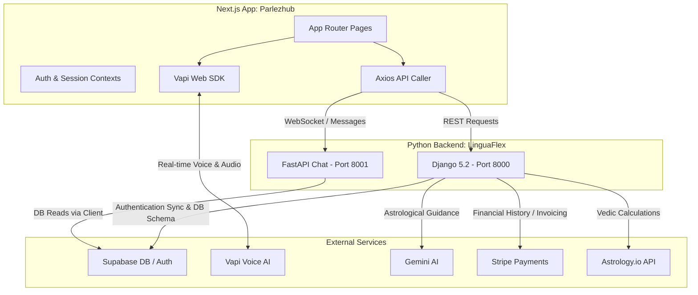
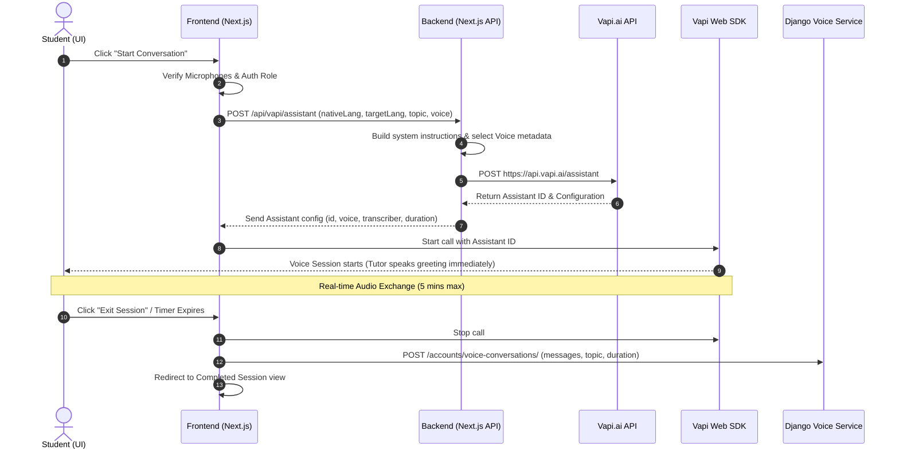
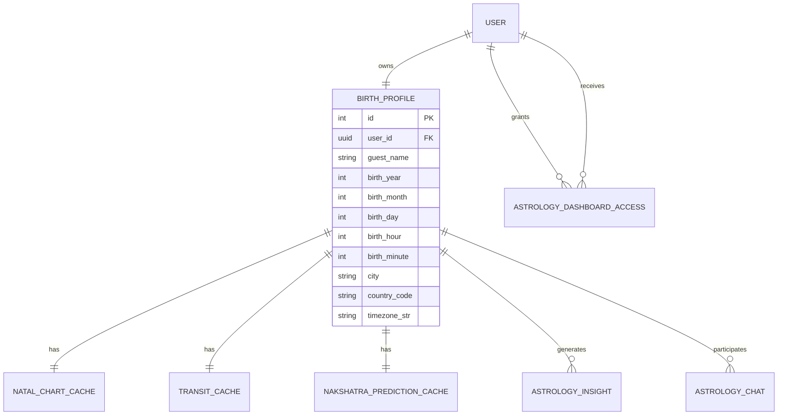

# Parlezhub & LinguaFlex Backend Architecture & Working Guide

Welcome to the comprehensive architecture and working guide for the **Parlezhub** frontend and **LinguaFlex** backend applications. This document outlines the design decisions, component layouts, integration patterns, and complete flows for the two primary systems.

---

## 🗺️ High-Level System Overview

The project is built as a **decoupled web application** utilizing a Next.js frontend and a hybrid Python backend (Django + FastAPI), all integrated with Supabase for data management and authentication.

---

## 🔑 Authentication & Token Synchronization

The system leverages **Supabase** as the single identity provider. 

1. **Client Authentication**: Next.js logs the user in using the Supabase client SDK. The access token (JWT) is kept in memory and cookie store.
2. **API Request Interceptor (`api-caller.ts`)**: 
   * To prevent the Web Locks API blocking issue that occurs when requesting sessions concurrently during token refresh (~every 30s), a cached token is fetched from `tokenStore`.
   * If a `401 Unauthorized` is returned, a response interceptor automatically triggers `supabase.auth.refreshSession()`, updates `tokenStore`, and retries the original request.
3. **Backend Authentication (`core.authentication.SupabaseTokenAuthentication`)**:
   * Django decodes and validates the Supabase bearer JWT using the project's Supabase public configuration.
   * If valid, it matches the `sub` claim with Django’s custom `User.id` (stored as a native `UUIDField`) to authenticate the request.

---

## 🌍 Multilingual Voice Tutor Agent (Vapi.ai)

The system replaces the legacy OpenAI Realtime API with the robust **Vapi Web SDK**, enabling voice-based conversations across **40+ languages** with high-fidelity speech-to-text (STT) and text-to-speech (TTS) provided by **ElevenLabs** and **Deepgram**.

### 1. Voice Agent Lifecycle Flow

### 2. Custom Pedagogical Prompts
The `/api/vapi/assistant` endpoint constructs a rich **System Instruction prompt** featuring:
* **Identity & Persona**: Configures the agent (named "Max") with patient, curious, and structured characteristics.
* **Grammatical Self-reference**: Adapts pronouns and morphology to match the tutor's configured gender (e.g. `main khati hoon` vs `main khata hoon` in Urdu/Hindi).
* **Dual-Language Boundaries**: Instructs the agent to explain concepts in the user's **native language** while conducting exercises and pronunciation practice in the **target language**.
* **Immersion Flow**: Includes immediate greetings, warmup tasks, interactive homework, and kind, selective inline corrections.

---

## 🌌 Vedic Astrology Engine & AI Readings

The Vedic Astrology module combines calculations from the external `Astrology.io` API with advanced, structured interpretations generated by **Gemini AI**.

### 1. Database Model Design (`astrology/models.py`)

* **`BirthProfile`**: Contains birth coordinates and time. Support is included for both authenticated students (`user_id`) and guest profiles (`created_by` teacher).
* **`NatalChartCache`**: Caches static coordinates (D1 Chart, D9 Chart, Vimshottari Dasha, KP System) permanently, ensuring the external API is only hit once.
* **`TransitCache` / `NakshatraPredictionCache`**: Stores daily transit information. It checks `cached_for_date` against the current day in the user's timezone on every load, invalidating automatically without recurring cron jobs.
* **`AstrologyInsight`**: Caches AI-generated readings across 18 unique categories (e.g., `mental_health`, `marriage`, `lagna_lord`) to guarantee instant page loads and avoid excessive API bills.
* **`AstrologyChat`**: Holds multi-turn scoped chats. When a student asks the AI questions about a specific insight card, a rolling window of the last 8 messages is provided as context.

### 2. Cache Invalidation & Insight Generation Flow
When a user updates their birth coordinates via a `PUT` request:
1. **Cache Purge**: The database triggers a deletion of all associated `NatalChartCache`, `TransitCache`, `AstrologyInsight`, and `AstrologyChat` instances.
2. **Background Recalculation**: Django starts a background thread via `generate_all_insights_async` to fetch fresh API values and trigger Gemini insights.
3. **Optimistic Locking**: An active lock (`generating_insight_PROFILE_ID_CATEGORY`) is written to Django's cache. If the frontend requests a card while generation is in progress, the backend responds with `202 Accepted` to prevent duplicate parallel processes.
4. **Exponential Backoff**: To handle high volumes of Gemini API requests, a custom helper `_generate_insight_with_backoff` automatically manages API rate limits (backing off up to 40 seconds) when `429 Resource Exhausted` is encountered.

### 3. Astro Visualizer (`vedic-chart.tsx`)
The frontend uses standard browser layout features to display Vedic charts:
* Renders a dual-layered South Indian style chart grid representing the 12 houses.
* Dynamically positions planets based on degrees and zodiac signs.
* Synchronizes both **natal planet positions** and **current transiting planet positions** simultaneously, providing an immersive astronomical overlay.

---

## 🎨 Premium Styling & Responsive Layouts
* **Tailwind & Radix UI**: Combined for accessible, customizable components using custom styling systems.
* **Dynamic Animations**: Implemented with **Framer Motion** for sleek, smooth page transitions and visual components (such as the pulsing Voice Blob in language sessions).
* **Harmonious Theme**: Built on dark celestial visual aesthetics suitable for a workspace containing both speech training and astrological dashboards.
* **Mobile Ready**: Controlled with hooks like `useMobile` to gracefully resize grids, side panels, and tabular data on smaller screens.
